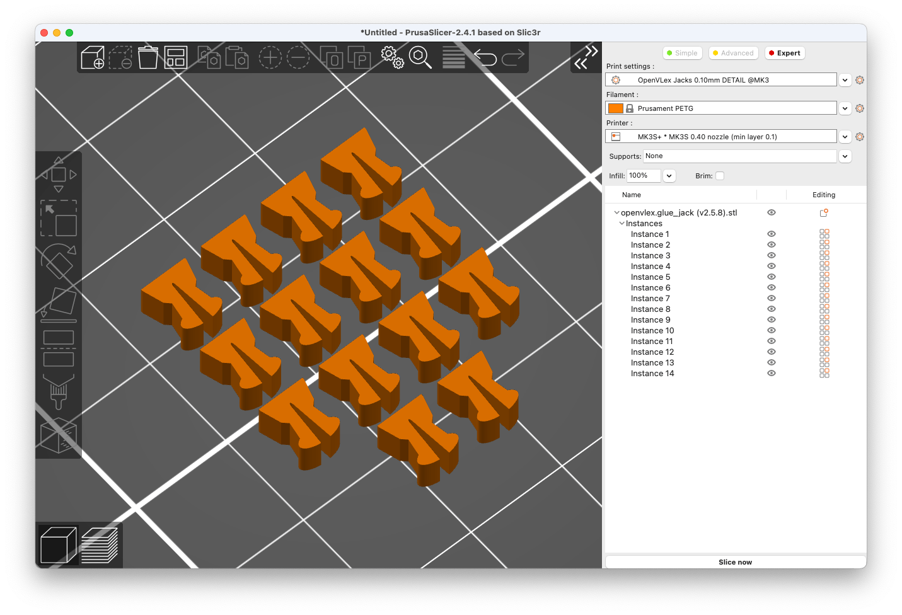
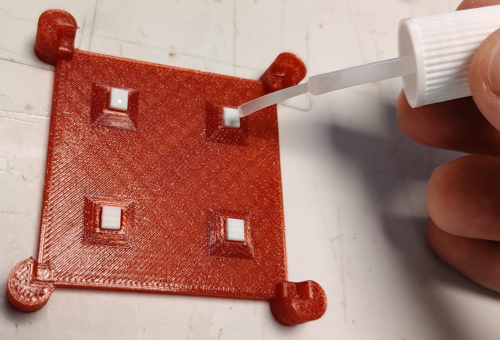
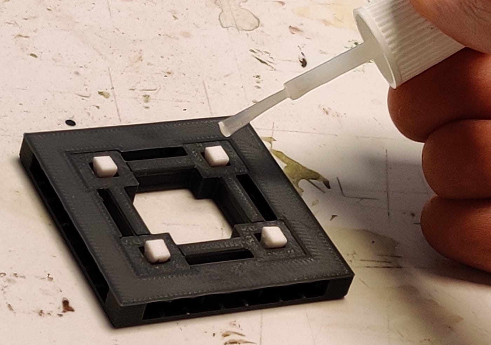
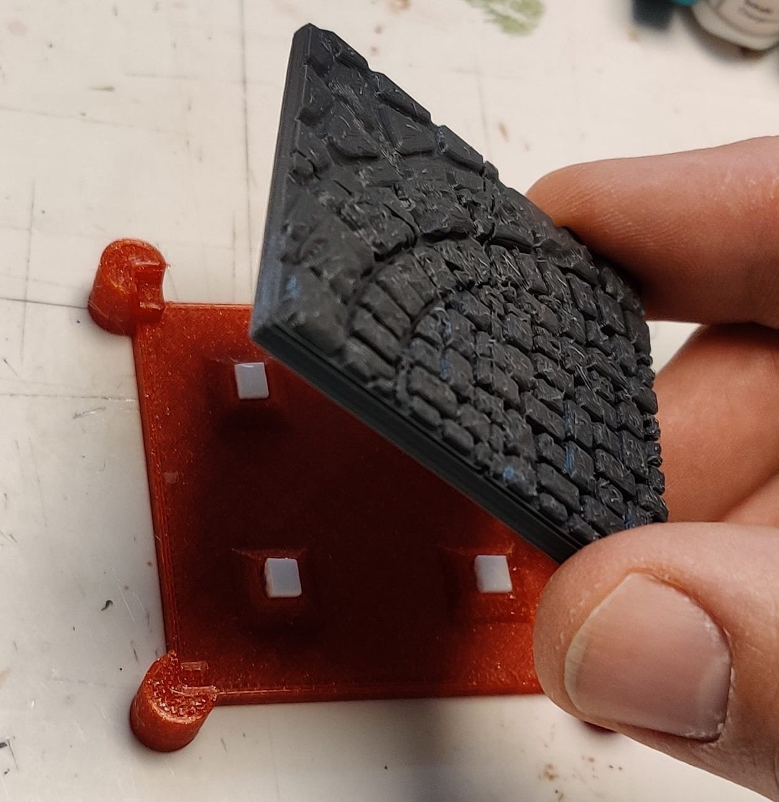
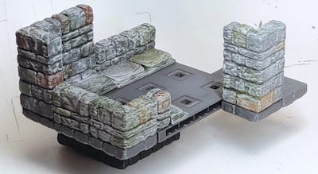
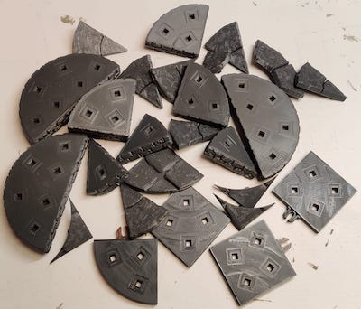
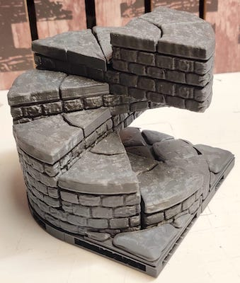

<h1 align="center">OpenVLex 2</h1>

A decor-to-base <b>V</b>ertical <b>L</b>ocking <b>ex</b>tension system for 3D printed terrain

  <a href="#about">About</a> •
  <a href="#download">Download</a> •
  <a href="#getting-started">Getting Started</a> •
  <a href="#faqs">FAQs</a> •
  <a href="#credits">Credits</a> •
  <a href="#license">License</a>

## About

OpenVLex makes it possible to print and use base and terrain parts more **flexibly** by providing a special vertical locking mechanism while still adhering to the widely used, well-established tile locking systems. You can use the same terrain decor piece with bases of different sizes or locking standards. Think OpenForge 2.0, but instead of gluing, you clip your terrain pieces to the base.  
For now, OpenVLex supports bases with **OpenLOCK (Triplex)** standard, and also the versatile **OpenForge Magnetic OpenLOCK** bases. Other locking systems (Dragonlock, Infinitylock) may be supported in the future.

### What to expect

OpenVLex vertical locking can be used in many ways, but the most common use case is that you have versatile painted "wall on tile" (aka "wall on floor") terrain pieces that you want to reuse in multiple scenarios with different room sizes.

#### Key features:

- **Extend** the tile sets you already have. OpenVLex is **NOT yet another tile locking system**, but serves to make Magnetic/OpenLOCK tiles even more versatile.

- Magnetic bases are cool and handy, but not as versatile and not as solidly clipping together as Triplex parts: With OpenVLex you can **choose the right tile locking system "just in time"**.

- Large overhanging (upper) floors clipped together are not always as solid as they need to be. With OpenVLex you can build **rock solid upper floors** even with tiny 1x1 wall or corner pieces on up to 8x8 bases (or even larger if your printer is capable).

- With reusable OpenVLex magnetic bases, you need **much fewer magnetic balls** in total.

- OpenVLex **risers and stair parts** can be stacked and plugged together directly, giving you endless possibilities.

- OpenVLex gives you **dynamic floors out of the box**: each 1x1 floor tile can immediately be used for mosaics, patterned floors or as a scatter.

- With OpenVLex you can **re-use** your **wall-on-tile parts** (walls, floors, ...) on the **outside** of your dungeons or buildings without having ugly holes in the foundation.

- OpenVLex allows you to flexibly exchange the base of **"separate wall"** parts and make an **interior 1/2 inch** wide interior wall out of an exterior wall. This wall can be locked by using special 1/2 inch "through hole" clips.

- With a basic set of reusable bases in different sizes, you will never have to print a base again. **Save printing time and money**. And save plastic and rare earths (magnets). Save the planet! :earth_africa::earth_americas::earth_asia::nerd_face:

- OpenVLex is a non-commercial **open source** solution that I created in my spare time. Feel **free to use** it. No need to buy me a coffee or a beer, instead, just be a nice person and help people in need :relaxed:.  
  And please share your experiences with OpenVLex and give me feedback!

## Download

You can find the latest release [here](https://github.com/manolitto/openvlex2/releases/latest).

## Getting started

To give you an idea of how OpenVLex works and the advantages it offers, you can follow this guide:

1. Choose your favourite OpenForge 2.0 floor terrain set.  
   > If you are unsure, start with Devon Jones' well-known [OpenForge 2.0 Dungeon Stone Floor](https://www.thingiverse.com/thing:2740273)

2. Print **one** 1x1, **one** 2x2 and **four** 2x1 inch based (Dungeon Stone) floor parts.  
   Print only the decor parts without the OpenForge 2.0 bases!  
   > **Printing time:** ~3 hours at medium quality on a FFF printer
   
   

3. Download [the latest version](https://github.com/manolitto/openvlex2/releases/latest) of OpenVLex 2 if you haven't already done so.

4. Print fourteen **[OpenVLex jacks](jacks/)**. See [jack printing details and hints](jacks/README.md).  
   > **Printing time:** < 40 mins
   
   

5. Glue the jacks to the floor parts. See [jack gluing instructions](jacks/README.md#gluing-instructions).  
   > **Note:** You only need thirteen jacks, one is a spare
   
   Either with a [gluing stencil](./gluing-stencil/README.md) (recommended)
   
   Or with an already printed [OpenVLex base](./bases/README.md)
   
     
     
     

6. Print out some **[OpenVLex Triplex bases](bases/plain/triplex/)** in the sizes you want. For now, print only one of each of your preferred sizes from the following list: 1x1, 2x1, 2x2, 3x2, 3x3, 4x1, 4x2, 4x3, 5x1, 5x2, 6x1, 6x2, 7x1, 8x1.  
   See [printing instructions for bases](bases/README.md).  
   > **Printing times:** 1x1 = ~20 mins, 2x2 = ~1 hour, 7x1 = ~2 hours
   
   

7. **(Optional)** :man_artist: In the meantime, paint your floor parts. :woman_artist:

8. :thumbsup: **Done!**  
   Enjoy having **14 (fourteen!) different tile sizes** at your disposal with just six printed (and painted :pleading_face:) floor pieces!  
   
     
     
     
   
   And look forward to even more flexibility! :astonished: Continue reading...

### Next steps

If you are either not yet convinced or already eager to learn more about the possibilities of OpenVLex, here are a few ideas and pointers:

- Print **other floor styles** (Cut Stone, Rough Stone, Towne, ...) in the common sizes 1x1, 2x1 and 2x2. Apply OpenVLex jacks and use them with your new OpenVLex bases in different sizes.  
  
  

- Print out some **[OpenVLex Magnetic bases](bases/plain/magnetic.openlock/)** (see [instructions](bases/README.md)) and use them as alternative (magnetic) bases for situations and scenes where you need more flexibility during play sessions.
     
  

- Print out "wall on tile" **walls, corners and doors** and use OpenVLex to combine them with floors to create different sized tiles or even whole rooms.  
  
    
    
    
  

- Print some **[OpenVLex Riser and Stair remixes](stairs_and_risers/)**, apply OpenVLex jacks ...

  
  
  ... and enjoy stacking and plugging the pieces together to build stairs and platforms in endless variety.
  
  
  

- Print a type "A" separate wall and use it either as an exterior wall with a textured base or as an interior wall by using the special [1/2 inch OpenVLex base](bases/separate_wall/).

- Print a bunch of 1x1 floor tiles of different styles (e.g. Dwarven Plain and Knotwork) and enjoy building **mosaics and patterned floor** tiles in endless variety.

- Print terrain and building parts from other systems and vendors (like OpenLOCK, DRAGONLOCK, Tilescape, ...) and combine them all with your new flexible OpenVLex bases. See FAQs below for instructions about preparing such parts.

- Build amazing dungeons and houses. Have fun! :star_struck:

## FAQs

**Question:** OpenForge walls and corners from the construction sets are normally glued to the base together with matching floor parts. How does this work with OpenVLex jacks?  

**Answer:** Print them together as one piece! Just put the pieces you want to combine together in your slicer. In Slic3r/PrusaSlicer/SuperSlicer it's pretty easy. I assume it is also possible in Cura, but I have never tried it.

---

**Q:** Sometimes larger floor tiles are difficult to detach and remove from the base. Any tips?

**A:** If using your fingernails :nail_care: is not an option :grimacing:, use flat-nose pliers to press the jacks together from the underside and carefully push them through. Or use a flat screwdriver to carefully and gradually spread the two parts apart from all four sides.

**New**: You may also consider using the new [disassembly tool](disassembly-tool/)!

---

**Q:** The jacks look fragile and I am sure I will manage to break one. I don't want to throw away painted tiles because of a broken jack!  

**A:** Rest assured that you don't have to! Try to remove the broken jack with pliers and a carpet knife (:warning: Watch your fingers! :face_with_head_bandage:). If the joint is too strong, put the tile into the freezer for some while. This makes the superglue brittle. (Thanks, Devon Jones, for this valuable hint!)

---

**Q:** Can I use terrain and building tiles from other systems and vendors with OpenVLex?

**A:** Yes, you can use whatever tile you want (as soon as it is based on some kind of modular grid system)! Simply cut away the bottom part of the tile (the part where the holes for the proprietary locking mechanism are). Most slicer applications already support cutting pieces horizontally, so you do not even need 3D software for this. Here are hints for some systems:

  - OpenLOCK terrain tiles: cut away and drop 6 mm from bottom
  - DRAGONLOCK:
    - Most Tile Sets: drop bottom 5.28 mm
    - Some Tile Sets: drop just 5.21 mm (the minimum DRAGONLOCK base height)
    - Shadowgrove Forest: cutting away 6mm from bottom works quite well
  - Tilescape: drop 6.4 mm from bottom of tiles with integrated frame, nothing to drop for frameless tiles

---

### What about OpenFLex 1?

The old OpenFLex 1 system is no longer maintained and I recommend switching to OpenVLex 2.

But wait, what if ...

- ... you already have a bunch of floor and wall tiles with **legacy plug plates** attached?  
  Simply put the tiles into the freezer for some while. This makes the superglue brittle and lets you easily remove the old plates with the help of pliers and a carpet knife (:warning: Watch your fingers! :face_with_head_bandage:). Then replace them with the appropriate number of OpenVLex 2 jacks.

- ... you already have a bunch of **legacy OpenFLex 1 base parts**?  
  Although you can convert them to the new standard with the [adapter](openflex1_to_openvlex2_adapter/README.md), I strongly recommend that you print new bases instead, reuse the magnetic balls and throw away or recycle the old bases.

- ... you already have some **expensively painted riser or stair parts** based on the legacy OpenFLex 1 system?  
  Do **not** throw them away! There is a way to make your old parts OpenVLex 2 compatible with [this special adapter part](openflex1_to_openvlex2_adapter/README.md).

## Credits

OpenVLex is based on OpenForge 2.0 by [Masterwork Tools](https://www.patreon.com/masterworktools/) and has been partially remixed from:

* [OpenForge 2.0 Wall On Tile Bases](https://www.thingiverse.com/thing:2740279)
* [OpenForge 2.0 Cut Stone Stairs](https://www.thingiverse.com/thing:1508410)
* [OpenForge 2.0 Dungeon Stone Stairs](https://www.thingiverse.com/thing:3393468)
* [OpenForge 2.0 Tudor Stairs](https://www.thingiverse.com/thing:1758162)

The OpenLOCK system was created by [Printablescenery](https://www.printablescenery.com/product/open-lock/).

## License

 OpenVLex 2 is licensed under a <a rel="license" href="http://creativecommons.org/licenses/by-sa/4.0/">Creative Commons Attribution-ShareAlike 4.0 International License</a>.

The OpenLOCK system is used under the BSD license: [Printablescenery OpenLOCK license](https://www.printablescenery.com/2021/03/17/openvlex-2/)
