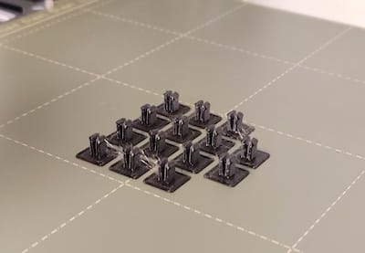

# OpenVLex 2

_OpenVLex is a **V**ertical tile-to-base **L**ocking system for 3D printed terrain._

OpenVLex makes it possible to print and use base and terrain parts in a more **flexible** way by providing a special vertical locking mechanism while still adhering to the widely used, well established tile locking systems. You can use the same terrain part with bases of different sizes or locking standards. Currently, OpenVLex supports bases with **OpenLOCK (Triplex)** standard, and also the versatile **OpenForge Magnetic OpenLOCK** bases. Other locking systems (Dragonlock, Infinitylock) might be supported in the future. 

### What to expect

The OpenVLex vertical locking can be used in many ways but the most common use case is having versatile, painted "wall on tile" (aka "wall on floor") terrain parts that you want to re-use in several scenarios with different room sizes.

Key features:

* **Extend** your already owned tile sets. OpenVLex is **NOT yet another tile locking system**, the purpose is to make Magnetic/OpenLOCK tiles even more versatile.

* Magnetic bases are cool and handy but not as versatile and not as solidly clipping together as Triplex parts: With OpenVLex you can **pick the appropriate tile locking system "just in time"**.

* Large overhanging (upper) floors clipped together are not always as solid as needed. With OpenVLex you can build **rock solid upper floors** even with tiny 1x1 wall or corner parts on up to 8x8 bases (or even larger if your printer is capable).

* With reusable OpenVLex magnetic bases you will need **much fewer magnetic balls** in total

* OpenVLex **risers and stair parts** can directly be stacked and plugged together giving you endless opportunities

* OpenVLex gives you **dynamic floors out of the box**: every 1x1 floor tile can immediately be used for mosaics, patterned floors or as scatter. 

* Save printing time and money. And save plastic and rare-earth (magnets). Save the planet! 🌍🌎🌏🤓

* OpenVLex is non-commercial open source and I created it in my spare time. Feel **free to use** it. Please do not buy me a coffee or a beer, instead please be a nice person and help people in need. ☺️   
  And please share your OpenVLex experience with me and give me feedback!  
  Download [here](https://github.com/manolitto/openvlex2/releases).

### Where to start

To give you an idea of how OpenVLex works and to give you a better feeling of it's benefits, you may follow this guide:

1. Chose your favorite OpenForge 2.0 floor terrain set.  
   (If unsure, start with Devon Jones' well-known <a href="https://www.thingiverse.com/thing:2740273" target="_blank">OpenForge 2.0 Dungeon Stone Floor</a>)
2. Print **one** 1x1, **one** 2x2 and **four** 2x1 inch based (Dungeon Stone) Floor tiles.  
   Print only the floor parts **without** the OpenForge 2.0 bases!  
   (Expect a printing time of ~ 3 hours with medium quality on FFF printer)  
   
3. Download [latest release](https://github.com/manolitto/openvlex2/releases) of OpenVLex 2 if not yet done.
4. Print fourteen **OpenVLex jacks**. See [jack printing details and hints](jacks/README.md).  
   (Printing time < 40 mins)  
   
5. Glue the jacks to the floor parts. See [jack gluing instructions](jacks/README.md).  
   (Note: You need only thirteen jacks, one is a spare)  
   
   
6. Print some **OpenVLex Triplex bases** of your favorite sizes. For now, just print one of each of the size you prefer from the following list: 1x1, 2x1, 2x2, 3x2, 3x3, 4x1, 4x2, 4x3, 5x1, 5x2, 6x1, 6x2, 7x1, 8x1  
   See [printing instructions for bases](bases/README.md).  
   (Printing times: 1x1 = ~20 mins, 2x2 = ~1 hour, 7x1 = ~2 hours)
   
7. Optional: 👩‍🎨 Paint your floor tiles in the meantime. 👨‍🎨
8. 👍 Finished!  
   Enjoy having **14 (fourteen!) different tile size opportunities** with just having printed (and painted 🥺 ) six floor parts!      
  
  
  
   
   And look forward to even more flexibility. 😲 Read on...
   
### Where to continue

If either you are not yet convinced or already eager to learn more about OpenVLex possibilities, here are some ideas and pointers:

* Print **other floor style parts** (Cut Stone, Rough Stone, Towne, ...) of common 1x1, 2x1 and 2x2 sizes. Apply OpenVLex jacks and enjoy using them with your ready bases of different sizes.  
  

* Print some **OpenVLex Magnetic bases** (see [instructions](bases/README.md)) and use them as alternative bases for situations and scenes where you need more flexibility during gaming sessions.    
  

* Print **walls, corners and doors** and use OpenVLex to combine them with floors to different sized tiles or even whole rooms.  
  
  
  

* Print some **OpenVLex Riser and Stair remixes**, apply OpenVLex jacks and enjoy stacking and plugging the parts together and building stairs and platforms in endless varieties.

* Print a bunch of 1x1 floor tiles of different styles (e.g. Dwarven Plain and Knotwork) and enjoy creating **mosaics and patterned floor** plates in endless varieties.

FAQs
----
Q: OpenForge walls and corners from the construction sets are normally glued onto the base together with matching floor parts. How does this work with OpenVLex jacks?  
A: Print them together as one part! Simply assemble the parts you want to combine in your slicer. In Slic3r/PrusaSlicer/SuperSlicer this is rather easy. I guess its also possible in Cura although I never tried.

Q: Sometimes larger floor tiles are hard to unplug and remove from the base. Any hints?  
A: If using your fingernails 💅&nbsp;is not an option 😬&nbsp;, use flat pliers to squeeze the jacks from the bottom side and gently push them through. Or use a flat screwdriver to carefully spread apart the two pieces from all four sides in gradual steps.
  
Q: The jacks look fragile and I am sure I will manage to break one. I do not want to throw away painted tiles because of a broken jack!  
A: Rest asured, you won't need to! Simply remove the broken jack with pliers and a carpet knife (⚠️ mind your fingers! 🤕). To be on the safe side you might consider using a less stronger plastic glue instead of super glue. However, I use cheap super glue myself and was able to completely remove jacks successfully several times.

### What about OpenFLex 1 ?

The old OpenFLex 1 system is no longer sustained and I recommend switching over to OpenVLex 2.

But wait, what if...

* ... you already have a bunch of floor and wall tiles with attached **legacy plug plates**? Simply remove those old plates by means of pliers and a carpet knife (⚠️ take care of your fingers!🤕). Then replace them by the corresponding number of OpenVLex 2 jacks.

* ... you already have a bunch of **legacy OpenFLex 1 base parts**? Although you may convert them to the new standard with the [adapter](openvlex_1to2_adapter/README.md), I strongly recommend printing new bases instead, re-use the magnetic balls, and throw away or recycle the old bases.

* ... you already have some **laboriously painted riser or stair parts** which are based on the legacy OpenFLex 1 system? Do **not** throw them away! There is a way to make your old parts OpenVLex 2 compatible with [this special adapter part](openvlex_1to2_adapter/README.md).

Credits
-------

OpenVLex is based on OpenForge 2.0 and partly remixed from:

* [https://www.thingiverse.com/thing:2740279](https://www.thingiverse.com/thing:2740279)
* [https://www.thingiverse.com/thing:1508410](https://www.thingiverse.com/thing:1508410)
* [https://www.thingiverse.com/thing:3393468](https://www.thingiverse.com/thing:3393468)
* [https://www.thingiverse.com/thing:1758162](https://www.thingiverse.com/thing:1758162)

