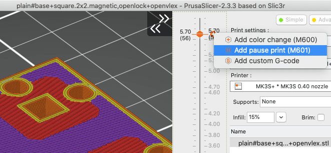

# OpenVLex 2 Bases

## About

OpenVLex bases can be used as universal bases for all your "wall on tile" terrain pieces. They can be used side by side with all your existing and your "separate wall" OpenForge and OpenLOCK tiles.

### Locking Systems: OpenLOCK, Triplex, Dragonlock

OpenVLex currently supports three different locking variants:

- "openlock,magnetic" - combination of single centered OpenLOCK holes and holes for magnetic spheres (or discs)
- "openlock" (formerly known as "triplex") - with or without additional "braces" structure (see below)
- "dragonlock" - early state / proof of concept

   
   

### Geometry: square, curved and radial

Most of the time you will need bases with "square" base area shape and "square" OpenVLex sockets geometry. When it comes to **curved** floors, stairs, or risers you will switch to "curved" base areas and "radial" sockets.

   
   
### Style

In addition to "plain" bases there are plans to add corner and edge bases in different styles. "Dungeon Stone" is the first supported OpenVLex base style.

   
   

## Instructions

### Magnetic OpenLOCK Bases

There are two ways to enclose the magnetic balls inside the base: print with pause or glue two parts.

#### Option 1: Magnetic OpenLOCK Bases - upper and lower parts glued together

If you are new to FDM printing or your slicer/printer does not support printing with a pause, follow this instructions for printing two parts that have to be glued together after inserting the magnets:

1. Print one lower part and one upper part of your chosen size.

   The files are named like this:
   - <code>plain#base+square.[W]x[L].magnetic,openlock+openvlex,lower_part</code>
   - <code>plain#base+square.[W]x[L].magnetic,openlock+openvlex,upper_part</code>

2. Turn the upper part over and insert 5 mm magnetic balls (or similar magnetic discs) into the round holes of the upper part.

3. Apply (super) glue, but be careful not to soil the magnetic balls.

4. Apply the bottom part and press the parts together. I recommend using clamps.

#### Option 2: Magnetic OpenLOCK Bases - print with pause

Important note: Please make sure that your FDM printer currently is equipped with a **brass nozzle**. Never try this with a steel nozzle - the magnets will get catched and you might damage your printer. Use at your own risk!

I also recommend **testing** this first with a very **small 1x1 base** to make sure the pausing works as expected. Some printers have issues with pausing by G-Code, especially when used with remote controlling software like OctoPrint.

1. Open the STL of the chosen size in your slicer (PrusaSlicer recommended).
   
   The files are named like this: <code>plain#base+square.[W]x[L].magnetic,openlock+openvlex.stl</code>
   
2. Add a pause print command at layer height 5.7 mm. Please google the exact method to achieve this with your slicer and printer!

   When using PrusaSlicer with a Prusa MK3 printer this would be the M601 command:

   

3. Start the print and when the print is paused, place the magnetic spheres inside the holes.
4. Resume the print

### OpenLOCK "Triplex" Bases

Print and postprocess similar to OpenForge bases.
Use flat-nose pliers to remove the supports. Be careful not to accidentally remove the OpenLOCK bars or braces structure.

> **Note:** With cheap PLA and/or with some printers it may be necessary to use bases with additional supports. If you see ugly holes on the top, you can either try to adjust your printer configuration to improve bridging (different PLA, hotend temperature, bridging speed, 0.10 mm layer height) or use the bases with additional braces - see below.

### OpenLOCK "Triplex" Bases with braces

If your OpenLOCK "Triplex" Bases come out nicely then you may simply ignore this variant. However, if you see holes on the surface of your OpenVLex bases (which might happen with cheap PLA) then you can try these alternative bases with additional structure instead.

> **Note:** These bases have additional tiny bars at the back wall of the triplex openings. They are NOT meant as removable
> printing support, they are small enough to not interfere with the OpenLOCK clip, and you do **NOT** need to **remove** them.

### Printing Notes

- Material: PLA or PETG
- Nozzle: 0.4 mm
- Layer height: 0.10 mm or 0.15 mm
- Fill Density: 10% to 15%
