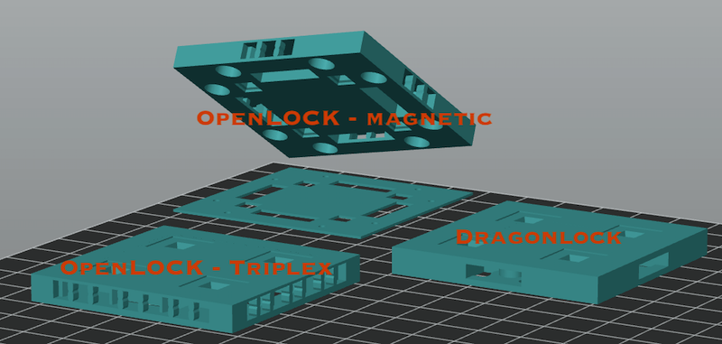
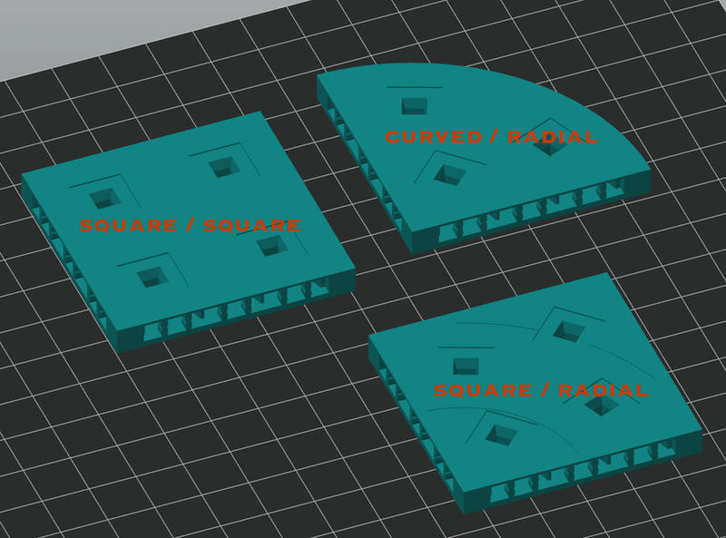

# OpenVLex 2 Bases

## About

OpenVLex bases can be used as universal bases for all your "wall on tile" terrain pieces. They can be used side by side with all your existing and your "separate wall" OpenForge and OpenLOCK tiles.

### Locking Systems: OpenLOCK, Triplex, Dragonlock

OpenVLex currently supports three different locking variants:

- magnetic.openlock
- triplex (or triplex.braced with additional braces to support the upper surface)
- dragonlock (early state - proof of concept)

   
   

### Geometry: square, curved and radial

Most of the time you will need bases with "square" shape and "square" geometry. When it comes to **curved** floors, stairs, or risers you should switch to "radial" bases.

   
   
### Style

In addition to "plain" bases there are plans to add corner and edge bases in different styles. "Dungeon Stone" is the first supported OpenVLex base style.

   
   

## Instructions

### Magnetic OpenLOCK Bases

1. Print one lower part and one upper part of your chosen size.

2. Turn the upper part over and insert 5 mm magnetic balls into the round holes of the upper part.

3. Apply (super) glue, but be careful not to soil the magnetic balls.

4. Apply it to the bottom part and press the parts together. I recommend using clamps.

### Triplex Bases

Print and postprocess similar to OpenForge bases.
Use flat-nose pliers to remove the supports. Be careful not to accidentally remove the OpenLOCK bars.

> **Note:** With cheap PLA and/or with some printers it may be necessary to use bases with additional supports. If you see ugly holes on the top, you can either try to adjust your printer configuration to improve bridging (different PLA, hotend temperature, bridging speed, 0.10 mm layer height) or use the bases with additional braces - see below.

### Triplex Bases (braced)

Alternative bases that can be used if you have difficulties with bridging and see holes on the surface of your triplex base.

> **Note:** These bases have additional tiny bars at the back wall of the triplex openings. They are not meant as
> printing support, they are small enough to not interfere with the OpenLOCK clip, and you do **NOT** need to remove them.

### Printing Notes

- Material: PLA or PETG
- Nozzle: 0.4 mm
- Layer height: 0.10 mm or 0.15 mm
- Fill Density: 10% to 15%
