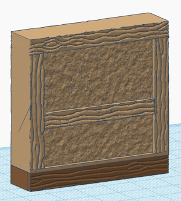
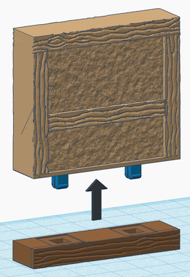
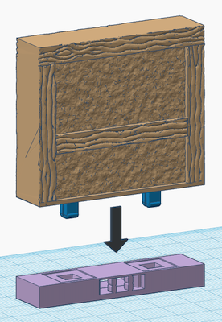
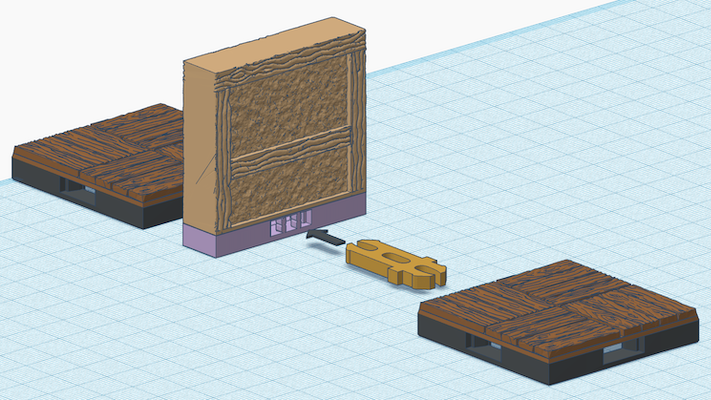

# OpenVLex 2 Separate Wall Bases

## Story

Here is the story:
Once upon a time. Just a good old 1/2 inch wide separate towne wall used as exterior wall...

"So far, so good. And then?"

"Look whats happening!"

<< plop! >>

<< snap! >>

"Today I feel like I need a 1/2 inch interior wall!"

"... which I now have together with that fantastic 1/2 inch _through hole_ clip !"

## Instructions

1. Print an OpenForge separate wall with taxonomy "A" from one of the following sets:

	- OpenForge Towne
	- OpenForge Cut Stone

2. Print one plain OpenVLex base: `plain#base.A.openlock,openvlex.stl`
3. Print one base which matches the wall style:

	- `towne#base.A.openlock,openvlex.stl`
	- `cut_stone#base.A.openlock,openvlex.stl`
	- `rough_stone#base.A.openlock,openvlex.stl`

4. Print two OpenVLex jacks
5. Glue the jacks to the bottom side of the wall. Use the plain OpenVLex base as a template.
6. As soon as the glue is dry carefully remove the wall from the base.
7. For now enjoy having two different bases for the same wall (one plain, one with texture) but do not stop here!
8. Download this special [OpenLOCK Clip Variants](https://www.drivethrurpg.com/product/325812/OpenLOCK-Clip-Variants) set.
9. Print the `OpenLOCK Half Inch Clip.stl`
10. Enjoy using your separate wall now as an interior wall by using that special "through hole" clip.
