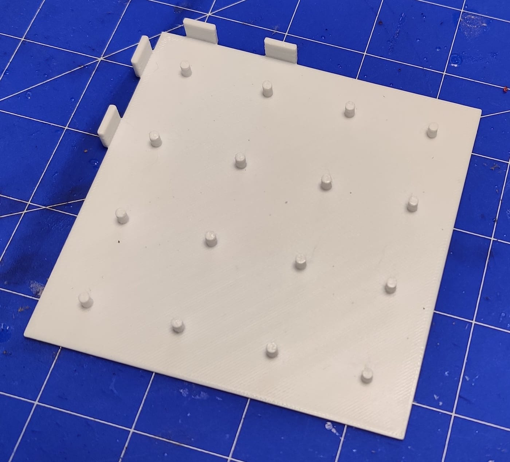
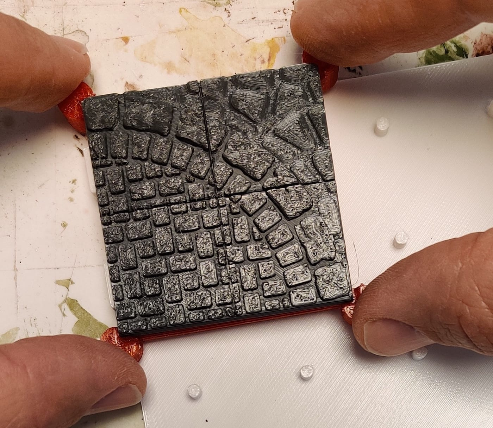
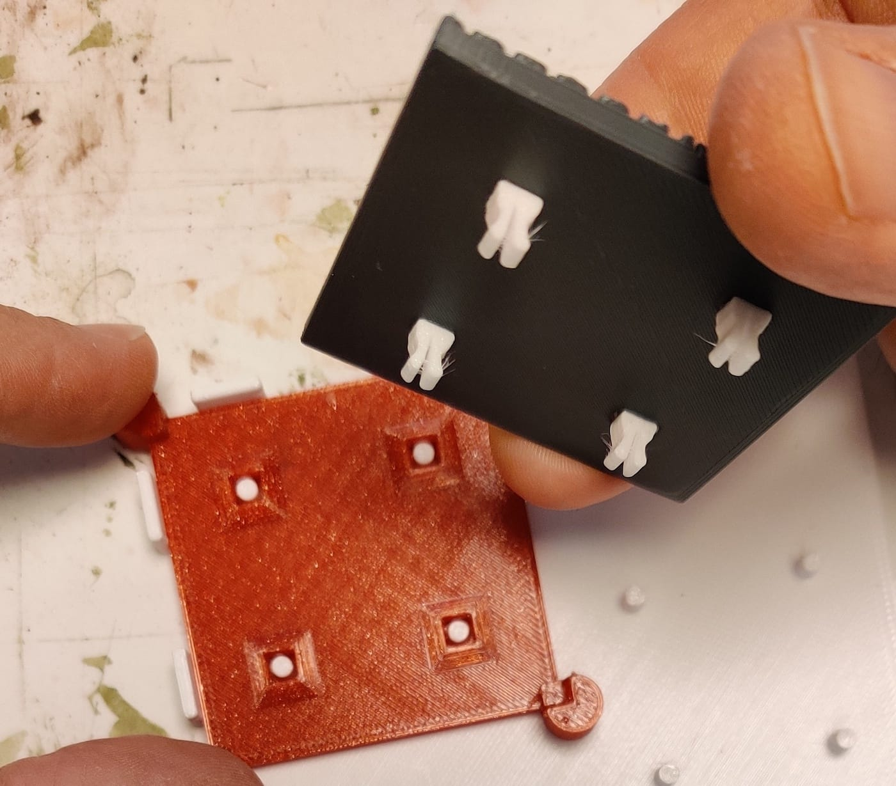

# OpenVLex Disassembly Tool (v2.5.2)

## About

The OpenVLex Disassembly Tool makes it easy to **remove tiles** from an OpenVLex base and is also convenient for removing tiles from the gluing stencil with freshly glued OpenVLex jacks.

   
	
## Usage

### 1. Align tile base or stencil

   
   
### 2. Press down the corners
   
   

## Printing Notes

- Material: PLA or PETG
- Nozzle: 0.4 mm
- Layer height: 0.10 mm or 0.15 mm
- Fill Density: 10% to 15%
