# OpenVLex Gluing Stencils

## About

Stencils for easier and more accurate gluing of OpenVLex jacks onto the underside of tiles.

   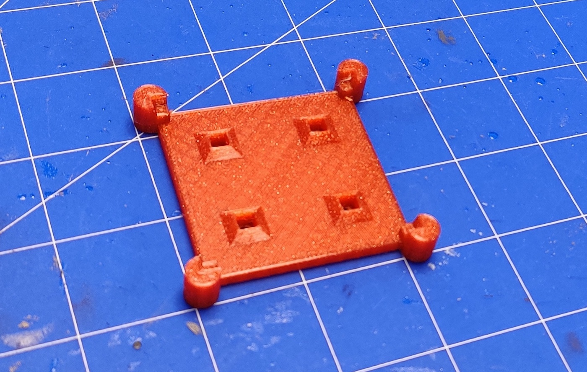 

## Instructions

As a basic set, print one 1x1, one 2x1 and one 2x2 stencil. This should cover 90% of your OpenVLex tiles. Remember that the purpose of OpenVLex is to prevent the need for exotic tile sizes.

## Usage

### 1. Place the jacks

   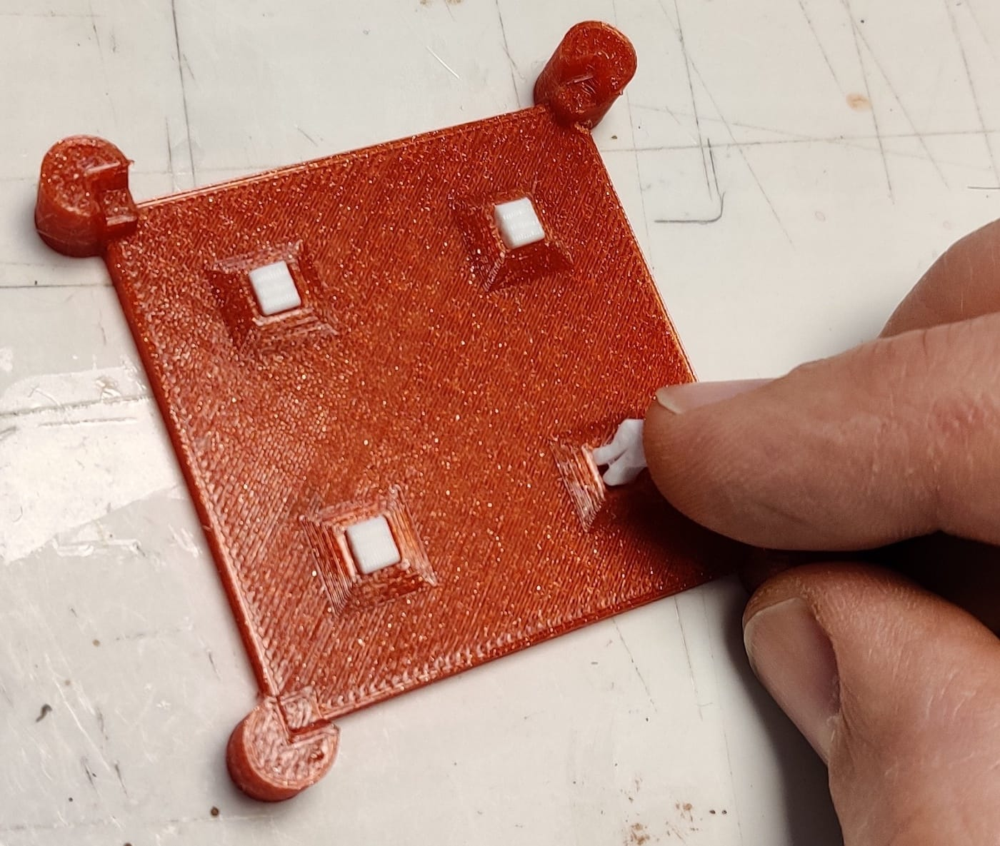 

### 2. Put glue on the jacks

   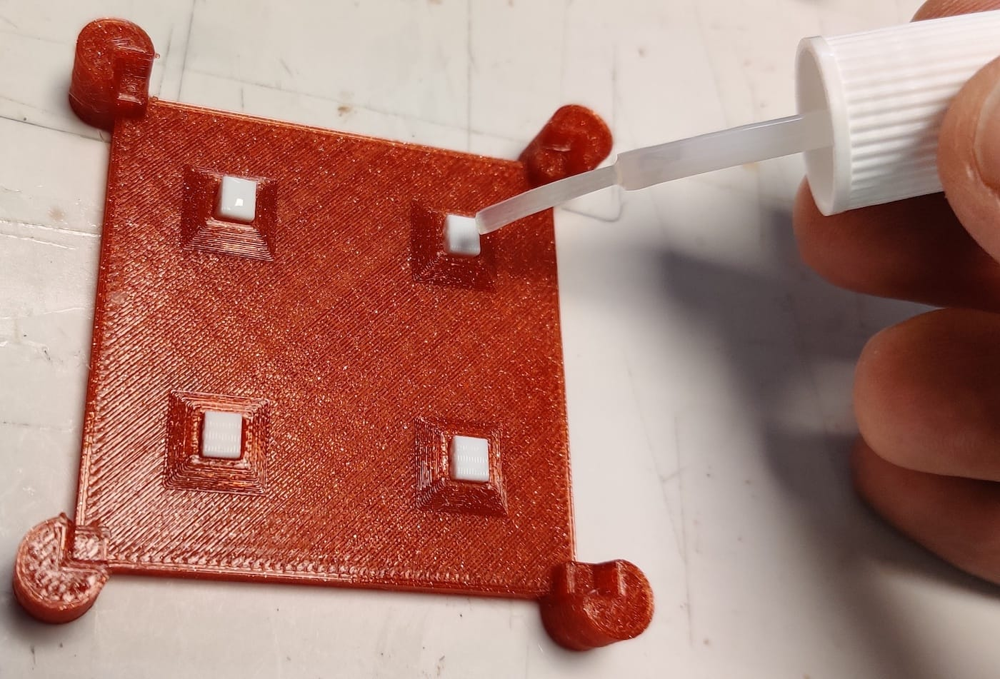 

### 3. Place the tile

    
   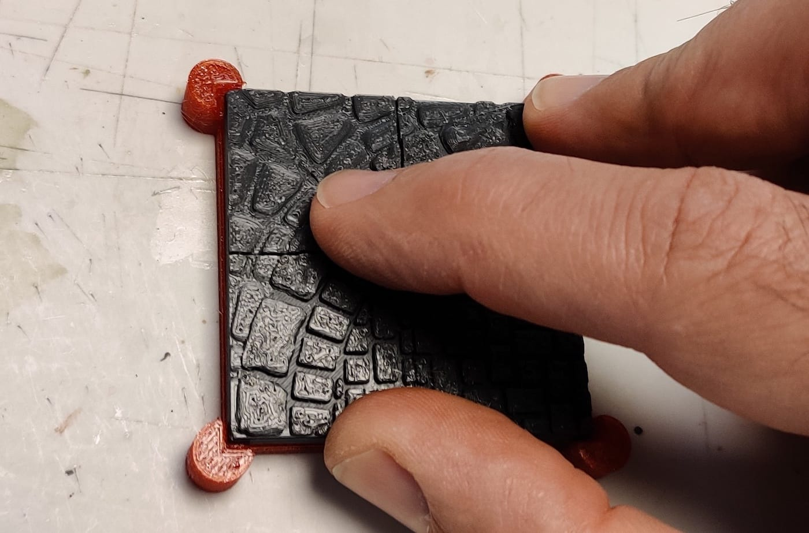 

### 4. Use clamps until glue is dry (but not too long)

   > **Note:** Keeping the parts upside down during drying prevents glue from dripping onto the stencil

   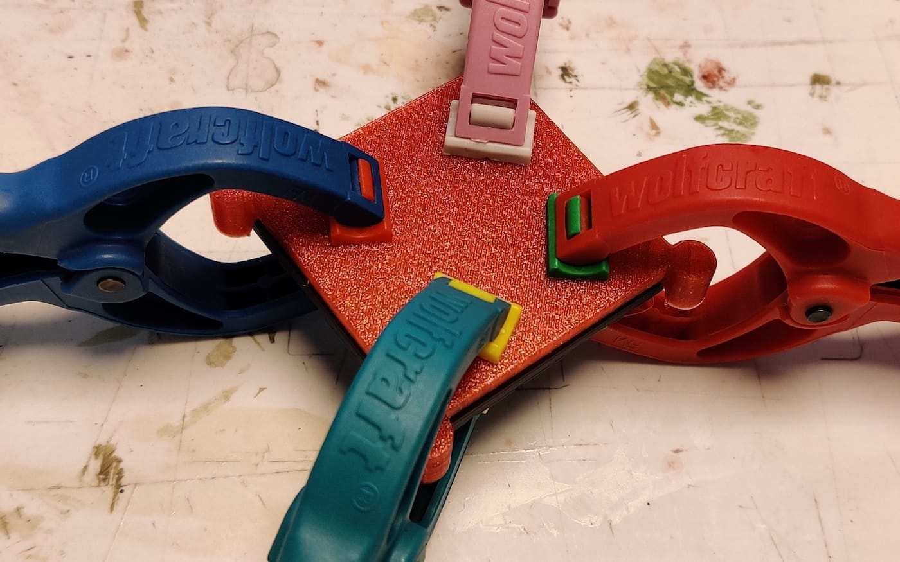 

### 5. Place stencil on [disassembly plate](../disassembly-tool/README.md) and push down corners

   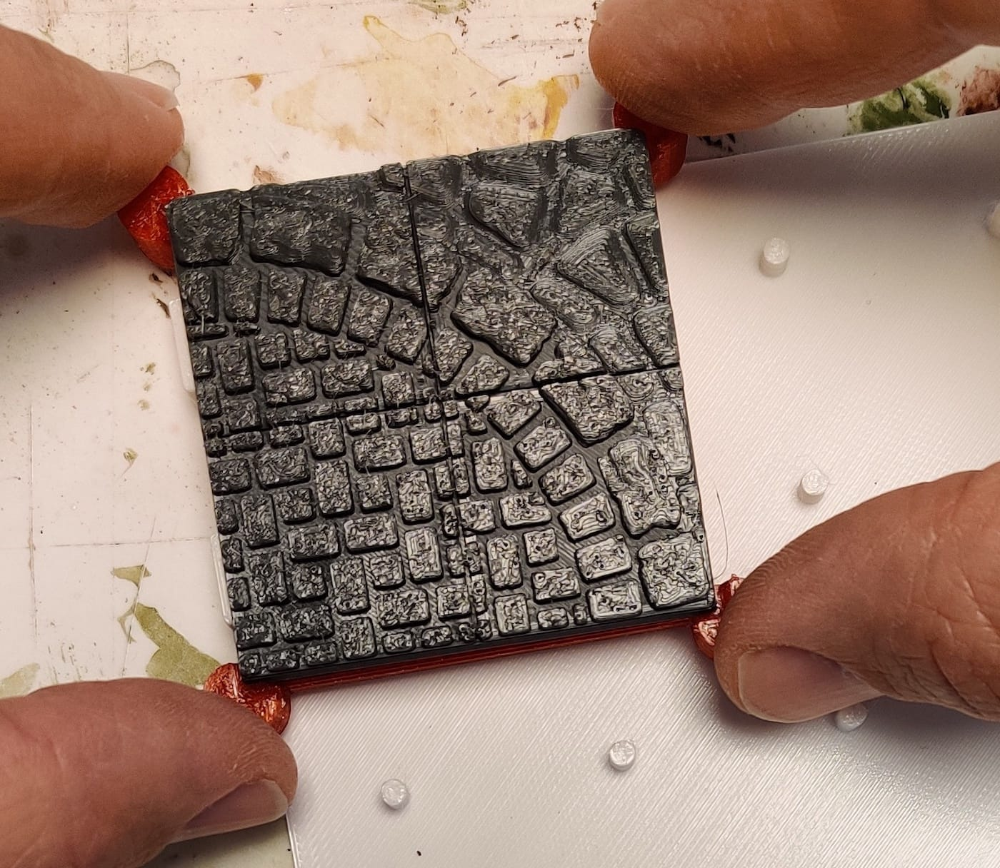 
   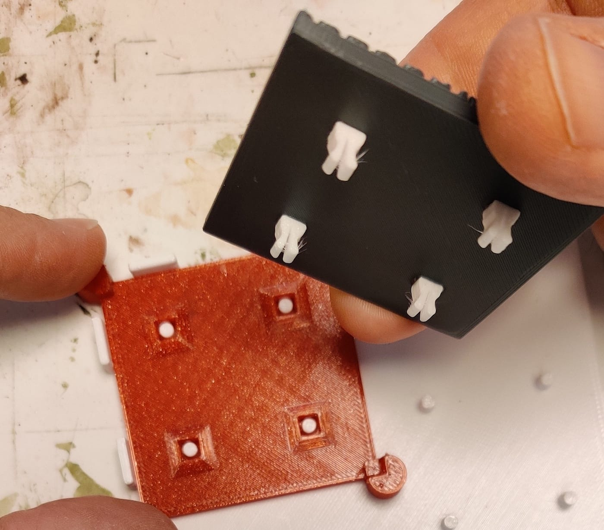 

### 6. Use your tile in the most VLexible ways

   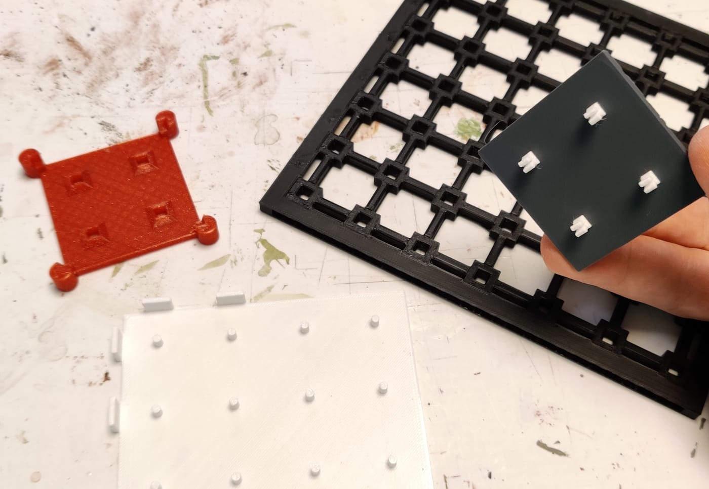 
   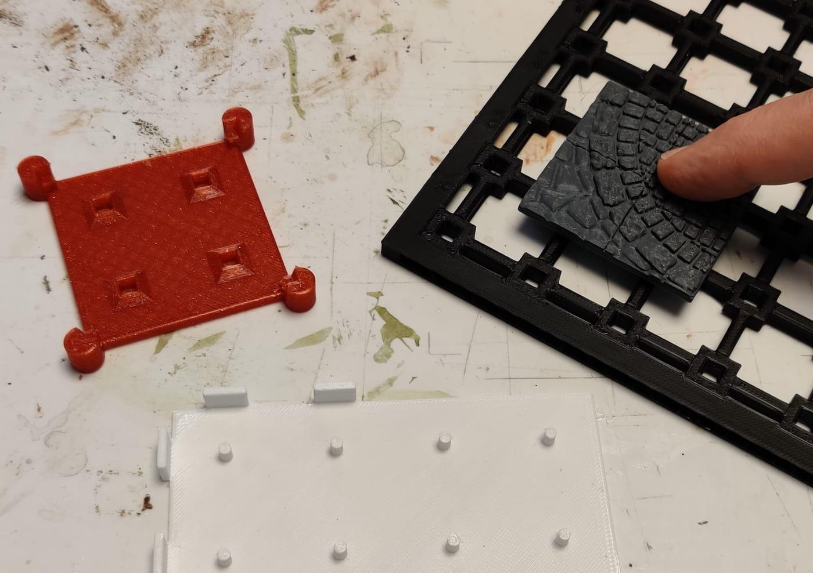 
   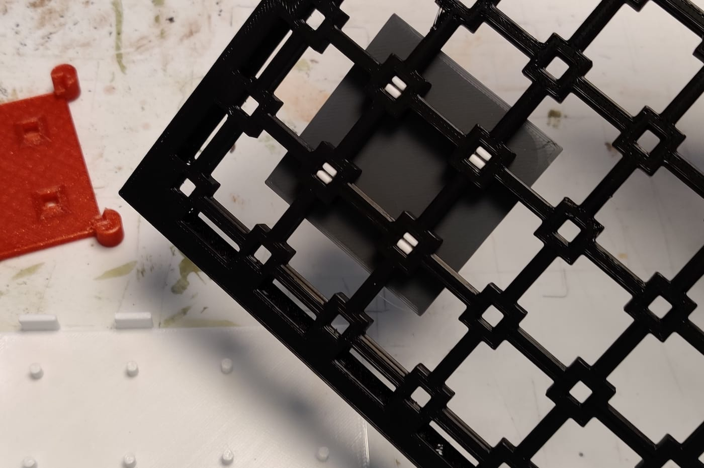 
   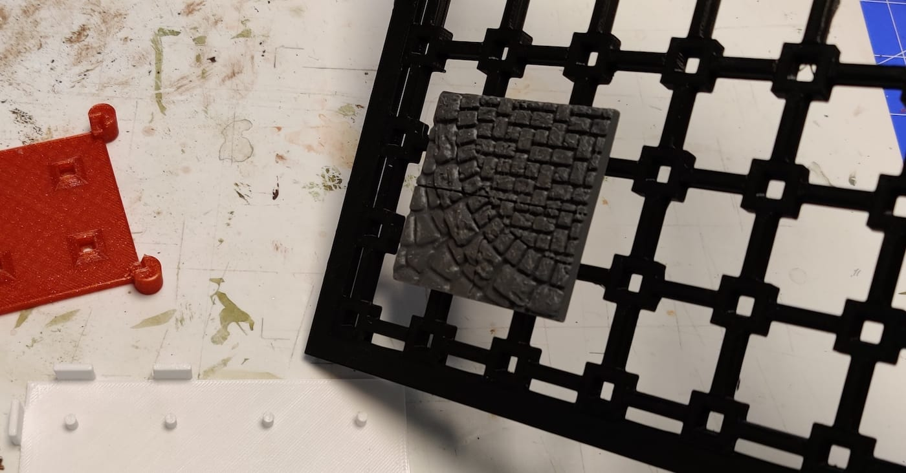 

## Printing Notes

- Material: PLA or PETG
- Nozzle: 0.4 mm
- Layer height: 0.10 mm or 0.15 mm
- Fill Density: 10% to 15%
