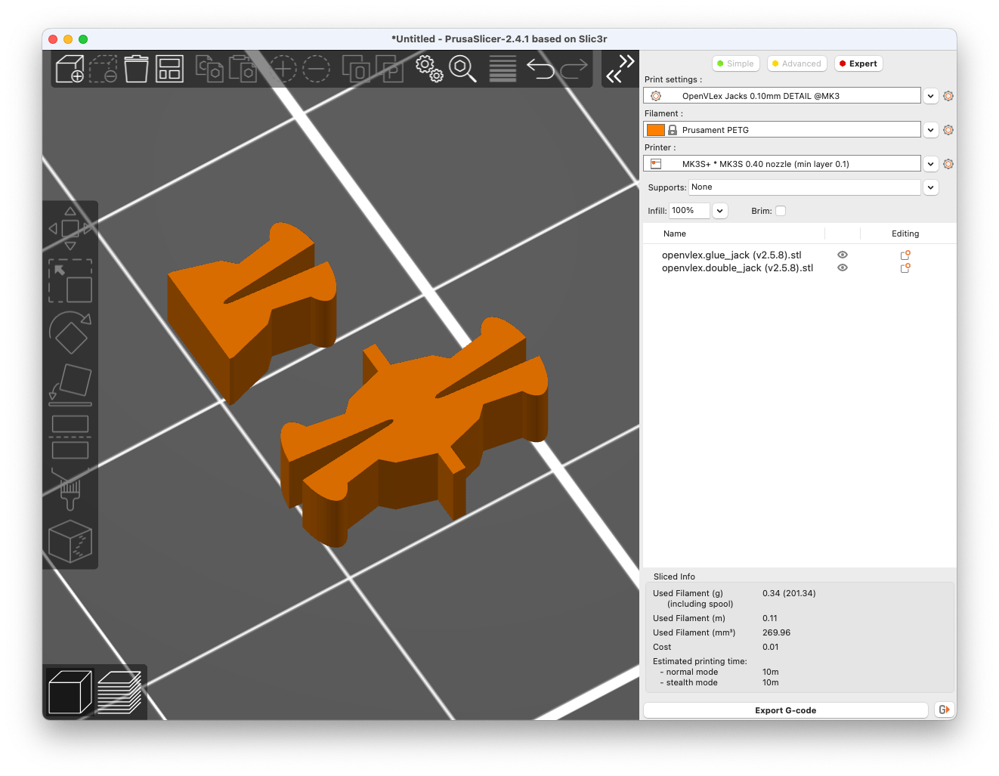
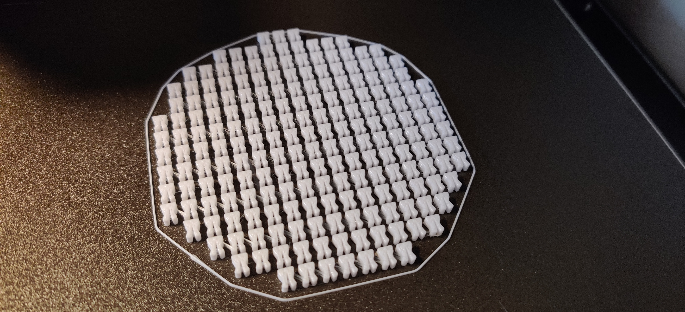

# OpenVLex Jacks

## About

OpenVLex jacks are used to vertically clip parts together. One or both of the parts must have an OpenVLex socket hole were the jack snaps in. There are two ways of clipping parts together:

1. Socket hole(s) on the lower part and standard jacks glued to the bottom surface of the upper part.

2. Socket hole(s) on both the lower and the upper part and a double-jack that clips them together.

## OpenVLex Standard Jacks

OpenVLex jacks are glued to the underside of "wall on tile" floor/wall tiles or risers (those without holes on the bottom side). Attach one jack per inch grid field. There is a printable stencil that makes gluing much easier and faster - see [gluing instructions](#gluing-instructions) below.

### Gluing Instructions

- The recommended way to glue OpenVLex jacks to your tiles is to use one of the [gluing stencils](../gluing-stencil/README.md). However, for just trying out and testing OpenVLex you do not need a stencil yet, just use an already printed OpenVLex base as a stencil.  
  
  

- Align the jacks of one tile so that they all have the same direction. This makes it easier to unplug the upper part later.

- For wall tiles and non-square floor tiles (e.g. 2x1), it is advisable to align the sockets so that the "slot" of the jack points towards the wall or the longer tile side. It is then much easier to unplug the tile by wiggling it slightly.

- Use **superglue**, which allows the tile to be used immediately after a few minutes. And in case a jack breaks one day it's easy to remove and replace it: put the tile into your freezer for a while and remove it with a carpet knife.

  
  
  

- Use clamps to press the pieces firmly together until the glue is dry and strong enough.

   > **Note:** Keeping the parts upside down during drying prevents glue from dripping onto the stencil

  

- Carefully remove the tile from the stencil. You can also use a flat screwdriver to carefully lift the tile or push the jacks through from the underside.

- You may also consider using the [disassembly tool](../disassembly-tool/README.md) for easily removing the tile from the stencil.

  

## OpenVLex Double Jacks

Use double jacks to vertically clip together OpenVLex parts (risers and stairs) that have holes on the bottom side.

## Printing Notes for OpenVLex Glue Jacks

> **Please note:** If you are completely new to 3D printing, please expect some challenges. I'm **not** saying you shouldn't try, it also depends a lot on the quality and capacity of your printer and the material. However, as these are tiny little things to print, you should have your **first layer** lessons learned.

- Material: PLA or PETG (recommended)

- Nozzle: 0.4 mm (or smaller)

- Layer height: 0.10 mm (recommended), 0.15 mm, 0.20 mm

- Fill Density: 100% (actually should not matter)

The jacks are quite small parts, so the most important issue is the adhesion of the first layer - as always with FFF printers. If you experience difficulties, you can try the following measures **after** you have fine-tuned your z-height:

1. **Lower** first layer **speed**
2. **Clean bed** with IPA
3. **Clean bed** with acetone (if using a PEI sheet)
4. Use **brims**
5. Raise **bed temperature** (slightly!)
6. Raise (or lower) **hotend temperature**
7. Try **different materials** - my recommendation is to use a not too brittle PLA or PETG!
