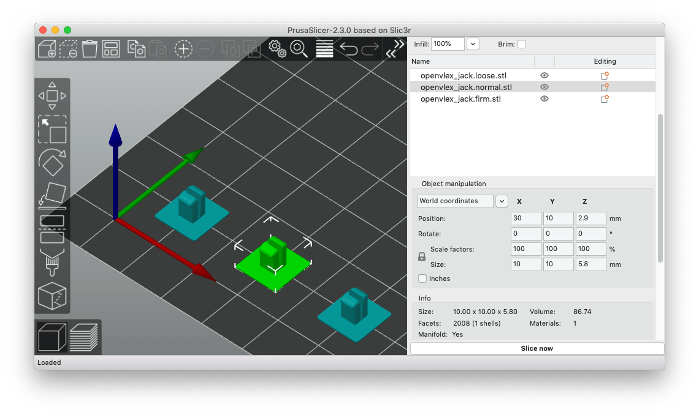
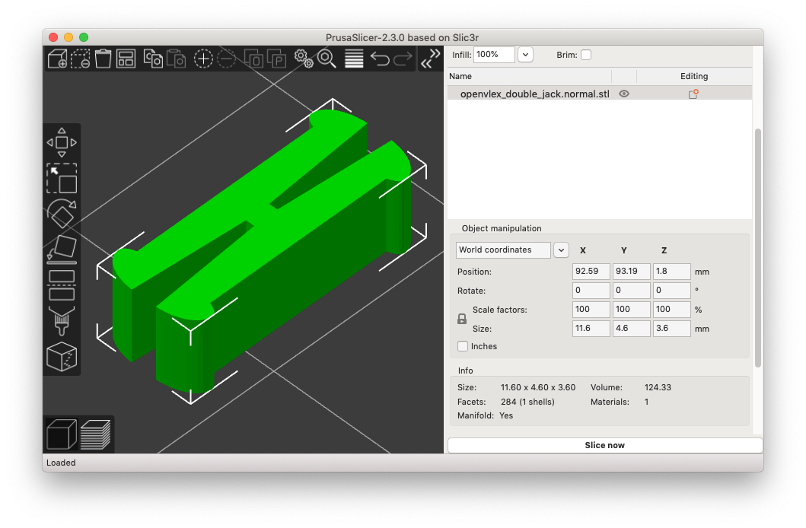

# OpenVLex Jacks

## About

OpenVLex jacks are used to vertically clip parts together. One or both of the parts must have an OpenVLex socket hole were the jack snaps in. There are two ways of clipping parts together:

1. Socket hole(s) on the lower part and jacks glued to the bottom surface of the upper part.

2. Socket hole(s) on both the lower and the upper part and a double-jack that clips them together.

## OpenVLex Glue Jacks

OpenVLex glue jacks are glued to the underside of "wall on tile" floor/wall tiles or risers (those without holes on the bottom side). Attach one jack per inch grid field. There is a printable stencil that makes gluing much easier and faster. See [gluing instructions](#gluing-instructions) below.

### Instructions for OpenVLex Glue Jacks

There are two slighty different variants of jacks for gluing to the bottom of parts:

- **normal** (5.8 mm) - try first 

  

- **firm**  (5.7 mm) - they hold together the parts a little bit stronger, but maybe too strong

  

The jack variants only differ in their length. To optimize your vertical tile to base locking experience (which depends on your printer and material), try out different lengths and use the one that fits best.

### Printing Notes for OpenVLex Glue Jacks

> **Please note:** If you are completely new to 3D printing, please expect some challenges. I'm **not** saying you shouldn't try, it also depends a lot on the quality and capacity of your printer and the material. However, as these are tiny little things to print, you should have your **first layer** lessons learned.

- Material: PLA (PETG might work but not yet tested)

- Nozzle: 0.4 mm

- Layer height: 0.10 mm

- Fill Density: 100% (actually should not matter)

The jacks are quite small parts, so the most important issue is the adhesion of the first layer - as always with FFF printers. If you experience difficulties, you can try the following measures **after** you have fine-tuned your z-height:

1. Raise **bed temperature**
2. **Lower** first layer **speed**
3. **Clean bed** with IPA
4. **Clean bed** with acetone (if using a PEI sheet)
5. Use **brims**
6. Raise (or lower) **hotend temperature**
7. Try **different PLA** - my recommendation is to use a not too brittle PLA!

### Gluing Instructions

- The recommended way to glue OpenVLex jacks to your tiles is to use one of the [gluing stencils](../gluing_stencils/README.md). However, for just trying out and testing OpenVLex you do not need a stencil yet, just use an already printed OpenVLex base as a stencil.  
  
  

- Align the jacks of one tile so that they all have the same direction. This makes it easier to unplug them later.

- For wall tiles and non-square floor tiles (e.g. 2x1), it is advisable to align the sockets so that the "slot" of the jack points towards the wall or the longer tile side. It is then much easier to unplug the tile by wiggling it slightly.

- Use **superglue**, which allows the tile to be used immediately after a few minutes. And in case a jack breaks one day it's easy to remove and replace it: put the tile into your freezer for a while and remove it with a carpet knife.

- Use clamps to press the pieces firmly together until the glue is strong enough.

- Carefully remove the tile from the stencil. It may help to gently press and push the jacks together from underneath with flat-nose pliers. You can also use a flat screwdriver to carefully lift the tile - that's what the notches on the stencil are for.

  Later, when you print and glue many jacks, you may also consider using the [disassembly tool](../disassembly_tool/README.md) for easily removing the tile from the stencil.

## OpenVLex Double Jacks

Use double jacks to vertically clip together OpenVLex parts (risers and stairs) that have holes on the bottom side.

There are two variants of the double jack:

1. **"normal"** (green one in image below): can be used as **universal joint** for clipping together parts with both having OpenVLex socket holes.
2. **"half strong"** (orange one in image below): can be used as a **permanent jack** that is clipped once and forever into bottom socket holes of stair/riser parts. Use the strong side of the jack (where the shorter cutting is) to permanently clip it into a socket hole.

### Printing Notes for OpenVLex Double Jacks

- Material: PLA (PETG might work but not yet tested)

- Nozzle: 0.4 mm

- Layer height: 0.15 mm or 0.20 mm

- Fill Density: 100% (actually should not matter)

- Brim: yes - use if you have difficulties with first layer adhesion

