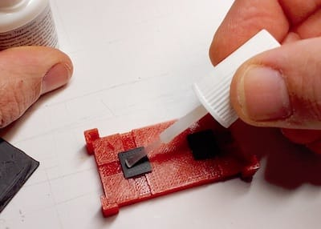

OpenVLex Jacks
--------------

OpenVLex jacks get glued to the bottom of "wall on tile" floor or wall tiles. Apply one jack per inch grid field. There is a printable stencil, which makes the gluing much easier and faster. See [gluing instructions](#gluing-instructions) below.

### Printing Notes for OpenVLex Jacks

Please note: If you are totally new to 3D printing, please expect some challenges. I am **not** saying you shouldn't try, it also greatly depends on the quality and capacity of your printer, of course. However, since these are tiny little thingies to print, you should have your **first layer** lessons learned.

- Material: PLA (PETG might work but not yet tested)
- Nozzle: 0.4 mm
- Layer height: 0.10 mm
- Fill Density: 100% (actually should not matter)

The jacks are rather small parts, so the most important issue is first layer adhesion - as always on FFF printers. If you experience difficulties you may try out different measures **after** you have fine-tuned your z height:

1. raise bed temperature
2. lower first layer speed
3. clean bed with IPA
4. clean bed with acetone (if using a PEI sheet)
5. use brims
6. raise hotend temperature
7. try different PLA

### Gluing Instructions

- The recommended way of gluing OpenVLex jacks to your tiles is to use one of the [gluing stencils](../gluing_stencils/README.md). However, to just try out and test OpenVLex you do not need a stencil yet, just use an already printed OpenVLex base as a stencil.  
   

- Align the jacks of one tile to all have the same direction. This makes later unplugging easier.
- For wall tiles and non-square floor tiles (like 2x1) the recommended orientation of the jacks is to align the jack's "slot" with the wall direction or the longer tile side, respectively. Its much easier then to unplug the tile by slightly wobbling it.
- Use either
  - plastic glue, which takes longer to be strong enough for plugging and unplugging the tile, or
  - super glue, which makes it possible to use the tile immediately after some minutes but is more difficult to remove in case one of the "lip" of the jack breaks some day.
- Use clamps to tightly press the parts together until the glue is strong enough.
- Carefully remove the tile from the stencil. It may help to gently squeeze and push the jacks from the bottom with flat pliers. And you may also use a flat screwdriver to gently lift the tile - this is what the notches on the stencil are for.
