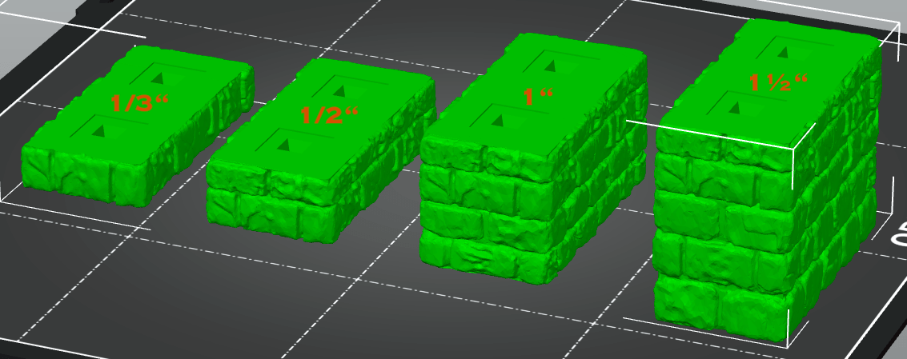

# OpenVLex 2 Stairs and Risers

## About

OpenVLex stairs and risers can be stacked and combined in endless variations.

  
  
  

## Instructions

### Height Variations

OpenVLex stairs and risers are available in different heights:

- 1/3" risers/stairs
- 1/2" risers/stairs
- 1" risers/stairs
- 1½" risers/stairs

  

- platforms to be used as top for risers/stairs

  

- "riser bases" combine a riser and the base for the next level:
  the compass direction in the file name describes where the locking sides are: NE means side locks north and east

  

### Clipping Variants

- For parts **without holes on the bottom** side (1/3" risers and platforms): print out [OpenVLex glue jacks](../jacks#openvlex-glue-jacks) and attach (i.e. glue) them to the bottom.

  Hint: Use another part of the same shape as a gluing stencil.

- For parts **with holes on the bottom** side ("openvlex.top\_and\_bottom"): print out some [OpenVLex double jacks](../jacks#openvlex-double-jacks) ("half strong" variant recommended) and use them to clip parts together **without gluing**.

  

### Printing Notes for Stairs and Risers

- Material: PLA or PETG
- Nozzle: 0.4 mm
- Layer height: 0.10 mm or 0.15 mm
- Fill Density: 10% to 15%
