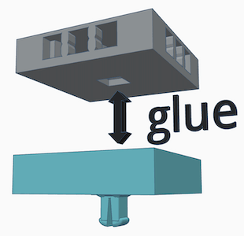

# OpenVLex Plain Riser Stacking System

## About

The new OpenVLex stackable riser system makes it possible to stack risers of any height by simply snapping them together.

  

Simply reuse standard OpenVLex bases (>= v2.4) together with "snappy" interlayer parts (green) or platform parts for the top most layer (blue).

### Save material and be flexible!

  

In the picture above a 2x4 medium riser is built just from three standard OpenVLex bases (grey) with four 2x1 riser interlayers (green) and two 2x2 riser platforms (blue).

## Instructions

### Interlayer Riser

For one interlayer part print two pieces of `plain#riser+square,interlayer_half.2x1.openvlex.stl` or `plain#riser+square,interlayer_half.2x2.openvlex.stl` and glue them together at the flat plain sides.

  

### 1x1 Riser

To get a 1x1 riser with 1/2 inch height ("low"), simply print one piece of the 1x1 platform riser (`plain#riser+square,platform.1x1.openvlex.stl`) and a standard 1x1 base (`plain#base+square.1x1.openlock,openvlex.stl`). Glue them together as shown in the following picture:

  

### Plain Platform Riser

Simply print one piece of `plain#riser+square,platform.1x1.openvlex.stl`, `plain#riser+square,platform.2x1.openvlex.stl`, or `plain#riser+square,platform.2x2.openvlex.stl` and enjoy the snapping when applied to an OpenVLex 2.4 base!

  

### Printing Notes for Plain Risers

- Material: PLA or PETG
- Nozzle: 0.4 mm
- Layer height: 0.10 mm
- Fill Density: 10% to 15%
