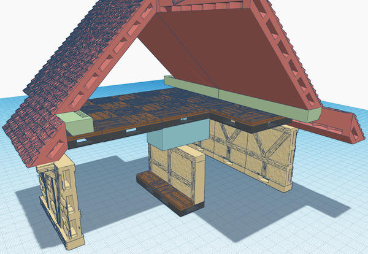

# OpenVLex Plain Riser Stacking System

## About

The new OpenVLex stackable riser system makes it possible to stack risers of any [OpenForge risers](https://mmf.io/o/192663) compatible height by simply snapping them together.

  

Simply reuse standard OpenVLex bases (>= v2.4) together with "snappy" interlayer parts (green) or platform parts for the top most layer (blue).

### Save material and be flexible!

  

In the picture above a 2x4 medium riser is built just from three standard OpenVLex bases (grey) with four 2x1 riser interlayers (green) and two 2x2 riser platforms (blue).

## Instructions

### Platform Riser

Simply print one piece of `plain#riser+square,platform.1x1.openvlex.stl`, `plain#riser+square,platform.2x1.openvlex.stl`, or `plain#riser+square,platform.2x2.openvlex.stl` and enjoy the snapping when applied to an OpenVLex 2.4 base!

  
  
☝️ Did you notice that this blocks can be plugged upon an OpenVLex 2.4 base from the top and also from the bottom?! Read on to learn why this is important.

### Low, Medium, and High Riser

For raising a base by ½ inch on top of another base, print two interlayer pieces (`plain#riser+square,interlayer_half.2x1.openvlex.stl` or `plain#riser+square,interlayer_half.2x2.openvlex.stl`) and glue them together at the flat plain sides like shown in this picture:

  
  
By combining several Interlayer Risers together with a Platform Riser and OpenVLex bases you can build every possible riser height. See pictures on top of this page.

### Platform 1x1 Riser

Simply print one piece of the 1x1 platform riser (`plain#riser+square,platform.1x1.openvlex.stl`) and plug it into a standard 1x1 OpenVLex base (`plain#base+square.1x1.openlock,openvlex.stl`).

  

### Low, Medium, and High 1x1 Riser

The new OpenVLex secondary vertical locking system cannot be used for 1x1 parts because there is no space left for that second locking mechanism. Instead, special 1x1 risers are provided which use the standard OpenVLex socket to give "plug-and-play" risers.

For an [OpenForge plain riser](https://mmf.io/o/192663) compatible low riser, print two pieces of the 1x1 platform riser (`plain#riser+square,platform.1x1.openvlex.stl`) and two standard 1x1 OpenVLex bases (`plain#base+square.1x1.openlock,openvlex.stl`). Glue **one** riser and **one** base part together as shown in the following picture:

  
  
For medium and high risers, create multiple glued together 1x1 platform risers and standard 1x1 OpenVLex bases. You can then stack them to the height you need by simply plugging them together.

There is also a ready-to-use 1x1 low riser (`plain#riser+square,low.1x1.openvlex.stl`) which can be used as an alternative to the glued+plugged low riser.

### 1/2" Support Riser aka "Façade Level Riser"

This special half inch high support blocks can be plugged into the bottom of OpenVLex 2.4 bases which can then be placed upon (2 inch high) interior walls and thus lift them to a height which matches the 2½ inch high [OpenForge Façade](https://mmf.io/o/139980) parts. See blue block in sample picture below:

  
  
These blocks are also useful in corners to hold the upper level in place and the upper façade aligned with the lower one.

### Low Riser used as "Roof Level Support Riser"

This special support blocks can be plugged into the bottom of OpenVLex bases bridging an attic floor between opposite [OpenForge Nx1.0 Shingles](https:mmf.io/o/135887). See blue block in sample picture below:

  

Like the Façade Level Support Risers (see above) these blocks are also useful when put in attic corners to hold the upper level in place and the roof aligned with the façade tiles below.

### Printing Notes for Plain Risers

- Material: PLA or PETG
- Nozzle: 0.4 mm
- Layer height: 0.10 mm
- Fill Density: 10% to 15%
