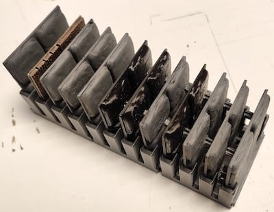

# OpenVLex Storage Clips

## About

Use storage clips to convert your OpenVLex bases to storage racks. 

## Instructions

Print two storage base clip parts and use them with a 2x2 (or larger) base to vertically store four floor tiles.

### Printing Notes

- Material: PLA or PETG
- Nozzle: 0.4 mm
- Layer height: 0.20 mm
- Fill Density: 20%
